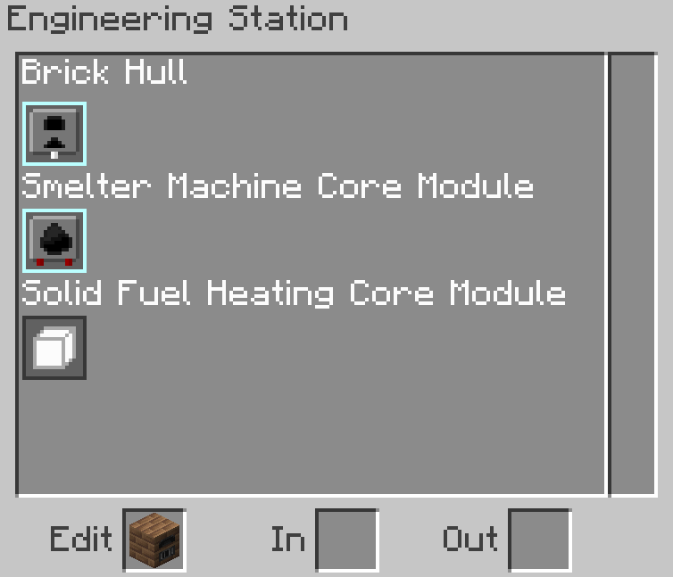
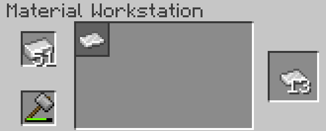

# MeepTech
This is a Minecraft technology mod for 1.21.1 Neoforge. The goal of the mod will be to progress through technology while building an automated factory. This mod took major inspiration from GregTech and other technology mods, but it will have significant deviations.
## (Planned) Features
- Machines will be customizable. You will be able to design your own machines out of modules to define their behavior, and you can choose the materials they're built out of.
- Materials have statistics (such as melting point, tensile strength, etc.) which determine the statistics of machines that use them.
- There will be a documentation of the mod in GuideME.
## Current Features
- In the early game, you can turn materials into other forms with the Material Workstation and the Hammer, without having to micro-craft.
- Machines can be designed in the Engineering Station with a recursive tree structure.
- Machines can support custom recipes.
- Full EMI integration for recipes.
- Various other minor features.
## Images
Basic Smelter:

Engineering Station:

Material Workstation:
